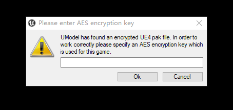
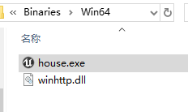
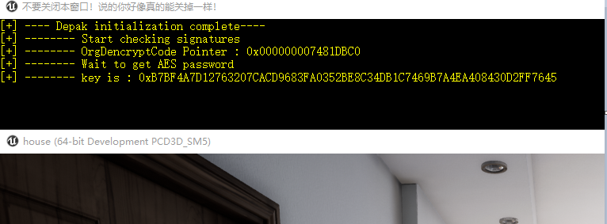

# UeDePak
本源码用于获取UE使用AES加密时的key -- 仅支持x64位游戏，仅测试了少量4.21版本编译的游戏  

本源码使用 vs2017 于 win10下编译  

**使用步骤**  
0.需配合 umodel 使用  
1.$运行目录 = 游戏根目录\WindowsNoEditor\游戏名\Binaries\Win64\  
2.将编译好的 winhttp.dll 放入 $运行目录 下  
3.运行 $运行目录 下的 游戏名.exe, 会弹出控制台窗口  
4.观察控制台窗口中的结果说明  

**运行截图**  
umodel打开长这样时,就可以试试碰碰运气了  
  

放到正确的目录(由于作者(也就是我:D)很懒,用了映像劫持,没有另外写注入器,所以这是必须的),然后运行该目录下的游戏  
  

观察结果,得到或者得不到  
  

把得到的key复制出来,标题栏上单击右键 -> 编辑 -> 标记 -> 按下回车键就复制出来了  
把复制出来的 key 粘贴到 umodel 的密码框中,能用就能用,不能用自己琢磨怎么搞,勿扰  

**其它**  
请无视我蹩脚的英语,问就是机翻  
顺便也无视我杂乱的代码,问就是屎堆里糊出来的

**免责声明**:  
balabala......总而言之,随意使用传播,作者不追究且不承担任何责任  
